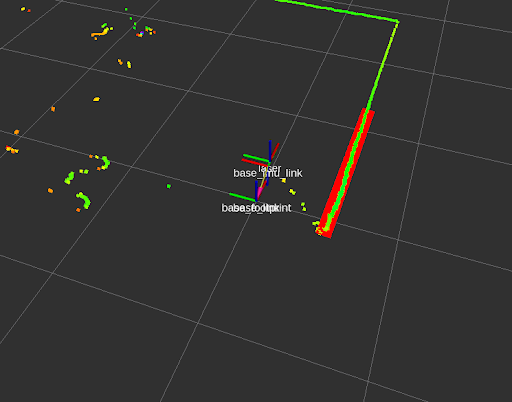

**Team 19: Stephanie Howe, Mary Lau, Prajwal Mahesh, Sean Crozier, Uche Okwo**

**6.141**

**2022 March 04**

# Lab 3 Report: Following the Wall without Crashing into It with Team 19
<!--
AUDIENCE: RSS faculty and staff, hypothetical managers, and professionals in the field (including your potential employers).   
PURPOSE: 
Write a persuasive argument demonstrating to faculty that you understand the Lab content  and that the algorithmic solution you designed is sound and works well in experiments or simulations.  Make claims for your work, supported by detailed technical explanation, justification, and experimental analysis that would be persuasive to a hypothetical manager unfamiliar with the Lab.  
-->

<!-- most of the editing was done by Mary Lau, TODO: distribute editing tasks, so that I can publish editors -->

> Edited by Mary Lau

## Introduction

> Author: *Prajwal Tumkur Mahesh*

One of the fundamental initial steps towards developing a useful autonomous robotic platform is creating a system that can observe its environment and extract actionable information from it. In physical systems, these interpretations are often used to make informed decisions about actuators or transducers that in turn create controlled physical change in the environment. The racecar platform used in this exercise is a small, mobile system built on a Traxxas Slash 4x4 chassis consisting of two physical actuators—a drive motor and a steering servo—along with a suite of sensors including a 2D LIDAR, a stereo camera, and an IMU which are used to measure and interpret the robot’s environment.
To connect the data gathered by these sensors to real-world actuation and movement of the robot platform, thereby allowing the racecar to autonomously navigate its environment, a non-trivial amount of control software was needed. As preliminary steps towards more advanced autonomy, two software controllers were created. The first of these was a wall following algorithm that allowed the racecar to independently drive parallel to walls at a fixed distance and velocity. The second was a safety controller that would prevent hardware damage from accidental crashes during autonomous driving by taking control of the platform and halting the car’s motion. Care was taken during development of the latter to understand the various situations in which such a controller would be necessary and to create an override protocol that would be robust enough to reliably protect the platform without being so overprotective that it would hinder intentional maneuvers. Together, along with teleoperated mode, these controllers encompass all essential driving modes of the robot, from full autonomous navigation and lower-level emergency control to manual steering.
Both of these tasks require the robot to sense and interpret the locations of physical objects in its proximity. Consequently, for both controllers, the LIDAR sensor was used to measure the radial distance of objects away from the robots and similar approaches were taken to translate these observations into robot maneuvers. In either case, a specific sliver of the LIDAR’s laser scan data was selected for analysis. The wall follower software used this subset of data to determine the location of a wall, understand the heading and distance of the robot relative to the wall, and move the steering actuator accordingly. On the other hand, the safety controller employed its subset of data to track the distance and velocity of relevant points to determine whether to stop the robot’s drive motor. Both controllers were first tested in a simulator before being deployed on the real-world hardware platform, where a trial-and-error evaluation process was used to tune parameters of both controllers and optimize behavior. This was a useful way to debug and tune these software controllers safely and the iterative tuning process was helpful for understanding the relation between the simulated and real behavior of the robot when transitioning from one to the other.

## Technical Approach: Wall Follower 

> Author: *Stephanie Howe*

The first technical challenge of this lab was to develop and test a wall following algorithm on a simulated autonomous car. By feeding the robot parameters such as which wall to follow (right or left), desired speed, and what distance to follow the wall, the goal was to develop a controller that allowed the car to follow the wall at a given distance, even in scenarios such as turning corners.

To implement the wall follower, we designed a  PD controller, which requires data from the racecar’s sensors.  More specifically, the wall follower subscribes to incoming LaserScan messages, which are published from the racecar’s LIDAR sensor. These LaserScan messages include information such as the range of angles the  LIDAR sensor scans, the increments between each angle reading, and distances of the nearest objects within scanning range. Given this information, our wall-follower algorithm is able to deduce the location of walls relative to the racecar.  

To construct the nearest wall from our laser scan data, we fitted a line to the distances given by the laser scan. As mentioned before, these distances indicate the location of the nearest physical object within a range of angles from the center of the racecar. Thus, we reasoned that fitting a line to these points would yield us the best approximation of the nearest wall for our racecar to follow. 
To go more into details of the implementation, we first converted each of the laser scan distances and their corresponding angles into cartesian coordinates. Then, we used np.polyfit() to fit this set of cartesian coordinates to a polynomial of degree 1 (aka a line).
As we iterated upon this wall-detection process, we decided to filter our laser scan data prior to fitting a line to our data. We did this by only considering points/scans that were within a certain distance to the car. We reasoned that this filtering would ensure the car would only be trying to follow portions of the wall that were closest to it, with this most relevant “portion” updating as the racecar moved. It seems that filtering solely the angle of the laser scan does not guarantee that the car won’t try to follow irrelevant walls. Thus, adding an extra layer of filtering via distance helped eliminate the detection of secondary walls or too-far obstacles and made sure that the car would only follow a wall once it was within a close enough radius.
Figures A and B show the racecar navigating a simulation environment, with the red line representing the estimated wall. As we see in Figure A, we can see our wall-detection method accurately visualizes the relevant wall as the racecar is adjacent to it. It is important to note the nature of this technique at the intersection of two walls. As illustrated in Figure B, once the car approaches a corner, the filtered subset of points will include information from both walls. As a result, a linear fit causes the estimated wall to be diagonal between these two walls. While this was an important factor in helping the racecar navigate corners, it is technically not an accurate representation of the wall.  

|  |  |
|:-----------------------------------------------:|:------------------------------------------------:|
| Simlulation following wall | Simulation following corner |

After preprocessing, there was enough information to develop the actual wall following controller, which gives the car turning directions based on how well it was navigating the environment. The formula for the wall controller is listed below.

$u=-SIDE \cdot K_p e(t) + K_d * \frac{de}{dt}$
$e = DESIRED\_DISTANCE - d$
$ \frac{de}{dt} = m\cdot VELOCITY $

The first set of terms, -SIDE * Kp * e(t) is what allows the racecar to maintain the desired distance to the car. The error term here is simply distance error, where actual distance (d) between the car and wall is the y-intercept of the wall line. The second set of terms, Kd*de/dt is what allows the car to stay parallel to the wall. The term de/dt is a bit of a misnomer here because it is not actually the derivative of the error term. In this case, it is dependent on the slope of the wall relative to the car. The final output of the controller, u, is what indicates the angle and direction at which the car should turn in order to correct for these errors as it traverses a room. 

After we got the  wall follower to  successfully run  in the simulated environment, we moved to the second task of the wall-following lab, to run it on the physical racecar.  The first challenge of this task was to familiarize ourselves  with the hardware of the racecar and navigate  the required steps to get everything running in sync. Once this was tackled, we had to take into account the slight differences between the simulated and real environments. In particular, the Kp and Kd parameters that were selected when tuning in the simulated environment were no longer the optimal parameters in the physical world. Additionally, the laser scans from an physical  LIDAR scanner are inherently noisier than that in  the idealized simulator. This may be a result of many factors including reflective surfaces and smudges on the scanner. One challenge that we encountered due to this noise was the detection of extraneous points in the environment that didn’t actually exist. In certain scenarios, this could temporarily throw off the accuracy of the line fitted to the wall, causing the racecar to navigate in undesirable ways. Going forward, we will need to account for this noise by further filtering the LIDAR scan for irrelevant points in the scan. 
  

## Technical Approach: Safety Controller

> Author: *Uche Okwo*

We were also tasked with keeping the hardware safe, as the sensors alone, not to mention the onboard computer, easily costs over a thousand dollars. One concern we had was having to code in a new safety mechanism with each lab. However, this is inefficient as we would have to repeatedly implement and test a common idea. Moreover, this approach wouldn’t take advantage of the ROS architecture, which employs multiple nodes with single responsibilities passing messages to each other to get things done. This ultimately leads us to the necessity of a safety controller, a single node responsible for keeping the expensive robot hardware safe from harm.
We first tried using a ship navigation principle as the basis of our safety controller: if something will collide with the racecar  in the future, it will remain at a constant angle with respect to the racecar  while its  radius to the racecar will decrease. As such, we anticipated that if we kept track of dr/dt (the rate that the radius at a certain angle is decreasing) for every angle of our laser scan data, we could calculate the expected time before collision, and plan accordingly. This principle is called constant bearing decreasing range, or CBDR. In simulation, this principle somewhat worked; however, we had trouble finding the actual relationship between dr/dt and the distance until collision. Moreover, we struggled to handle inaccurate lidar data, which would require smoothing of the dr/dt given noisy signals.
Moving forward from our first attempt with the CBDR implementation, we decided to simplify our process of predicting if the racecar would collide with an object in the near space and future, and if so, directing our racecar to stop.
Our final implementation of the safety controller consisted of two checks: thresholding with respect to distance and thresholding with respect to time. For the distance thresholding check, the robot checks if any of its laser scan distances are less than a certain threshold (aka stopping distance), to which we would cause the car to stop . This check is expected to handle situations, where a blocking element suddenly appears very close to the robot, for example, someone jaywalking in the path.
In addition to this distance thresholding check, we also wanted to take into account the velocity of the car. Designing our safety controller to function as a node subscribing to the high-level ackermann command mux topic, we could intercept drive messages going into the robot and apply  our second check: assuming constant velocity, the safety controller extrapolates the distance the racecar is expected to travel under a given time (aka stopping time); it then checks if any of the racecar’s laser scan distances are below that distance. If there are, the safety controller node publishes to the low-level ackermann command mux topic a velocity of zero, which will force the racecar to stop.  We initially hypothesized that this check would be robust to higher velocities, with the ability to dynamically adapt to any given velocity, but in practice, due to the non-idealized environment, this check does not perform as well for higher velocity safety-controller tests.

> Author: *Sean Crozier* 

Before the safety controller checks the laser scan data for possible collisions, it first filters the data into a set containing only points appearing less than 5 degrees from the centerline. The ranges found in this segment are usefully relevant to identifying obstacles as the width of this segment reaching the width of the robot at tan(5 degrees) = 0.1/x,  x = 1.14 meters out, without risking false positives from detecting obstacles the robot needs to pass nearer than our stopping distance. This distance was set to the larger value of 0.5 meters or one tenth of the goal distance between the robot and the wall.

Another mechanism of the safety control software is its ability to check time to collision assuming the robot continues at a constant velocity on a straight path. By multiplying the velocity passed to the drive commands with a predetermined time interval, the software sets a time-determined safety distance equal to the distance the robot would traverse in that interval, which we set to 0.5 seconds. When our robot travels more than 1 meter per second, the time-determined stopping distance is larger than the original stopping distance, which is equal to 0.5 meters, and so the robot begins to stop further from the obstacle.

Our choices of both stopping distances were bounded by our distance error while following the wall and the minimum braking distance of the robot. If the stopping distance was chosen to be higher than the difference between our desired distance to the wall and experimental distance error, the robot may trigger a stop while in the process of turning around a corner and adjusting itself to the new wall. This value, representing how close we might expect to come to the wall during normal operations, influenced both our stopping distance and stopping time, setting a maximum value of 0.75 meters for the stopping distance, and of 1.5 seconds for the stopping time. 

|  |
|:---:|
| Distance over time error |

The shortest distance in which the robot could stop, a value determined by the robot’s velocity prior to stopping, needed to be experimentally determined. Outside research investigating the stopping range of cars shows an approximately linear relationship between car velocity and stopping range. This means the time constant, which is multiplied by the robot’s velocity, can acceptably be set to a constant value. (Greibe, P. (2007). Braking distance, friction and behavior. Trafitec, Scion-DTU.)
Choosing a method for filtering our scans based on angles allows a variable width that correlates that angle with our stopping distance at a ratio of about 10%. An advantage this brings to our robot is an increase in caution when our velocity and time determined stopping distance increase. The width we detect will be able to see and be sensitive to obstacles further out in distance from our robot’s straight course, which allows for both variations in course and moving objects to be detected in useful areas.

## Experimental Evaluation

> Author: *Mary Lau*

To ensure that our implementations of the wall-follower and safety-controller were functional and accomplished our goal of responsive and safe autonomous navigation, we carried out evaluation in several stages. 
First, we ran both modules (wall-follower and safety-controller) through a series of tests in simulation, using rviz to observe the robot’s behavior. For the wall-follower, we had been provided a benchmark suite of wall-following scenarios from the previous lab which tested over different starting positions and starting angles of the car with respect to the wall, along with other pertinent parameters. We continued to build upon this test suite, using the rviz simulation to place our wall-follower implementation in new scenarios that the original suite did not cover, all of which contributed to our confidence that our wall-follower implementation would translate well to real life. 
For our safety-controller, we carried out a similar evaluation process in rviz. Together, we brainstormed different scenarios that we would expect to encounter where the safety-controller would need to suddenly stop the car, both with and without the wall-follower code simultaneously running. The majority of the cases we listed were easily testable in rviz: for instance, sending the car straight at the wall without a wall follower running, sending the car towards an inevitable collision with the right wall as it is following the opposite wall, etc. For each of these cases, we checked that the car successfully stopped at the distance we had set as our stopping distance. There were also certain cases that couldn’t be easily run in rviz; for example, a person abruptly walking right in front of the car, someone from next to/behind the car suddenly placing an obstacle in front of it. These would have to be carried out in real life.
After thoroughly testing our wall-follower and safety-controller in simulation, we moved to testing our code on the physical racecar. We began by determining the performance metrics we would be focusing on for the wall-follower and safety-controller. For the wall-follower, we prioritized 1) minimizing the overall error of the racecar’s distance from the wall (in comparison to the desired distance), 2) maintaining a smooth, non-jerky trajectory, and 3) being robust to various scenarios. To address the first two metrics, we recorded the racecar’s error (the difference of desired distance and actual distance of racecar from the wall) over the course of different racecar runs with the wall-follower. By plotting this error, we could visualize and quantitatively measure the accuracy, responsiveness, and smoothness of our racecar’s wall-following trajectory. With help from these plots, as well as the human eye, we were able to tune the constants of our wall-follower’s PID controller, until we ascertained that we had arrived at a wall-follower with acceptably small, consistent error and smooth, non-oscillatory trajectory. To evaluate robustness (the last metric), we ensured that the wall-follower yielded good error and smoothness metrics across different scenarios involving different sides to follow, starting positions/angles from the wall, and velocities.
For the safety-controller, we focused on 1) testing that the racecar would be able to safely and quickly stop for unexpected obstacles and 2) ensuring our safety-controller didn’t deter our racecar from following walls. To test that our safety controller was able to successfully stop, we carried out the aforementioned test cases that we could nottest in rviz. As the car moved forward, we placed both human and non-human obstacles in its way. As we intended, the safety-controller promptly stopped the robot in each of these cases. To evaluate the second metric, we ran the wall-follower and safety-controller simultaneously. Without any interference, the racecar continued to navigate and follow walls as before. In addition, we ran the prior safety-controller tests of abruptly putting unexpected obstacles in its path, in reaction to which the racecar was able to successfully stop, and upon removal of the obstacle, continue on its way.
	Thus, for our experimental evaluation, we made use of rviz to rigorously test our wall-follower and safety-controller implementations in simulation. Following this, we clearly defined the performance metrics we wanted to prioritize when testing independently, and eventually simultaneously, our wall-follower and safety-controller on the physical racecar. Finally, we recorded and tracked these metrics as we ran our code on the racecar, which we used to tune/improve upon and ultimately assess our final implementation to be an accurate, smooth, and robust wall-follower and responsive, but not over-protective safety-controller. 
	
## Conclusion

> Author: *Prajwal Tumkur Mahesh*

Having executed a number of tests for different scenarios, the wall follower and the safety controller appeared to successfully interpret environment data from the LIDAR sensor and maneuver the racecar platform accordingly. Through experimental tuning of control parameters in simulation and in hardware, the wall follower controller was able to navigate the racecar parallel to walls with minimal error and oscillation, even handling difficult situations like turning inside and outside corners and extreme starting configurations. In rare cases where surface reflectivity or other noise affected the LIDAR measurements, the controller did fail to follow the correct path. Moving forward, better filtering of input data may be needed to make the system resilient against this type of complication.
Similarly, the safety controller was able to halt the car in cases of sudden obstacles, human intervention, and blocked navigation routes. This was most robust at slower speeds however, and the controller failed to perform a successful override in several tests with higher racecar velocity. The conditions under which the software would decide that an emergency stop was necessary did not scale as expected when changing movement speed—a  problem which was further exacerbated by the momentum and long coasting distance of the robot at high speeds. Further tuning of the algorithm to better adapt to the racecar’s real-world behavior or even a complete reevaluation of stopping criteria may be required to improve performance.
Despite their potential for improvement, both controllers will be useful going forward and will serve as effective starting points on the path towards implementing more advanced autonomous procedures on the platform.

## Lessons Learned

> Author: *Prajwal Tumkur Mahesh*

In testing and debugging the wall follower controller, it became clear that the laser scan data was not as pristine on the real-world racecar as it was in the simulator. Various physical properties of the robot’s environment like reflectivity of surrounding surfaces, ambient light level, and even debris on the sensor would add unwanted noise to the LIDAR measurements. An input preprocessor node may be needed to clean up the data and remove any clear outliers in the scan ranges. This may also be the case with other onboard sensors like the IMU and potentially the stereo camera.
There was a slight learning curve with this first lab as we became accustomed to working as a team on a software project like this. In future labs, as the deliverables become more complex, it may be useful to better organize team communication so that the correct information reaches those that need it. This can potentially include dividing into clearer sub-teams and using separate slack channels for task-specific information, code, and image sharing.

> Author: *Uche Okwo*

I think mostly of what I should have done when I look back at this lab. Mostly in the field of reproducibility, I should have thought as an engineer and pursued avenues to make the job of the team easier by possibly having the robot produce rosbags, so that we could reproduce scenarios where we want to guarantee certain behaviors, or introducing some kind of unit or snapshot testing framework, so that in the future our robot should do what the code expects it to do. Just general project stuff that I would do on my own for random projects, but failed to connect it here mostly due to the fact that it is time-consuming to do so, and I didn’t spend as much time on the lab as I believe I should have.
Communication-wise, I think that the framework setup was amazing. We distributed tasks and kept up with each other on Slack, which I thought was really conducive to getting things done.

> Author: *Sean Crozier*

The biggest technical takeaway from this lab was to begin projects by completing what has to be done before moving on to what you want to be done. I wasted a lot of in-person time early on working on an aspect of the project that didn’t end up being implemented, when getting the program fully functioning to base requirements was more important for both the team and the lab. The compounding effects of this were less valuable in-person time working on collaborative aspects of the project, less robot time with regards to implementing the solution outside of simulation, and an unorganized work flow that put ends before beginnings and was more difficult to adapt to the rest of the team’s software.

With regards to communication, I definitely feel more helpful to the team if we set and meet deadlines at the beginning of the project. Slack, when-to-meet, the project planning board of notion, google drive, and github all worked very efficiently to keep us on track and on the same page.

> Author: *Stephanie Howe*

Throughout the course of this lab, a couple key takeaways on the technical front were the importance of testing as we went, and iterating on existing techniques. On the testing side, we only recorded quantitative evidence when testing distance error, but developing a more thorough testing protocol would have made tuning parameters more efficient and is something I would like to implement going forward. With regards to iteration, especially with the wall follower, I learned the importance of taking a step back and considering new avenues to solve the problem if the existing method isn’t working. On the communication side, delegation of technical tasks made a much more efficient work flow for the team. By assigning specific tasks to subsets of our groups, we were able to simultaneously work on different parts of the lab and dig deeper into one topic in particular.

> Author: *Mary Lau*

For me, one major technical takeaway from this lab was how helpful simulation is, more specifically having a benchmark test suite that we could run in rviz for every new iteration of our wall-follower and safety-controller implementation. In the early phases of development, we brainstormed as a team potentially challenging or interesting scenarios that our racecar may encounter (for both the wall-follower and safety-controller). After implementing the algorithms, we carried out these tests in the simulation. Overall, this process of testing and iteration was immensely helpful for determining the weaknesses of our code and where we needed to focus on to improve performance. And when it came time to move from simulation to the physical racecar, the testing we had done in simulation made us more confident and informed about our implementations. I do wish that we had taken the extra step of actually recording rosbags of the specific test cases we had brainstormed, instead of manually checking the case in rviz. Then we could have had a more streamlined process of testing and iteration, like that of the previous lab and the benchmark suite the staff had provided for us. 

In terms of communication, I think our team did well in maintaining a consistent flow of check-ins and updates on Slack. Whenever a member of our team finished a milestone, made an important change in the project, encountered a problem, etc, they would communicate that to Slack, so that everyone was made aware of our progress. Moreover, in this way, we could carry out a feedback loop of enthusiasm for things that members had achieved and encouragement/solution-brainstorming for things we were blocked on.